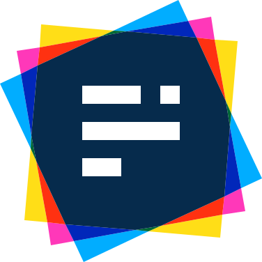

## 🖐️ Hello!

I'm Richard King, a **Full-Stack Software Engineer** and a ***UI/UX/Web Design enthusiast*** with **15 years in the industry**.

<!--  

    
  <picture>
    <source srcset="header_600.svg" media="(min-width: 950px)" />
    <source srcset="header_460.svg" media="(min-width: 525px)" />
    <source srcset="header_300.svg" media="(min-width: 200px)" />    
      
  </picture>

-->

## 🚀 Projects

<!-- @intradoc Projects -->
<ul>
  <!-- Pressfield -->
  <li>
    <a href="https://github.com/pressfield"></a>
    <b>&nbsp;Pressfield</b>
    <i>(<a href="https://github.com/pressfield">github.com/pressfield</a>)</i>
    

      Smart, automated, AI-driven software release updates and changelog publishing.
        
      <i>Keywords:</i> <b><i>AI, ML</i></b>
       
      <i>Tech Stack:</i> <a href="https://github.com/pressfield"></a><a href="https://github.com/pressfield"></a>
      

    

  </li>
  <!-- Pressfield -->
  <li>
    <a href="https://github.com/pressfield"></a>
    <b>&nbsp;Pressfield</b>
    <i>(<a href="https://github.com/pressfield">github.com/pressfield</a>)</i>
    

      Smart, automated, AI-driven software release updates and changelog publishing.
        
      <i>Keywords:</i> <b><i>AI, ML</i></b>
       
      <i>Tech Stack:</i> <a href="https://github.com/pressfield"></a><a href="https://github.com/pressfield"></a>
      

    

  </li>
</ul>

<!-- @intradoc Projects -->

<ul>
  <li>
    <a href="https://github.com/pressfield"></a>
    <b>&nbsp;Pressfield</b>
    <i>
      (<a href="https://github.com/pressfield">github.com/pressfield</a>)
    </i>    
    

      Smart, automated, AI-driven software release updates and changelog publishing.      
        
      <i>Keywords:</i> <b><i>AI, ML, DevOps, CI/CD, Social Media</i></b>
       
      <i>Tech Stack:</i> <a href="https://github.com/pressfield"></a>
      <a href="https://github.com/pressfield"></a>
      <a href="https://github.com/pressfield"></a>
      <a href="https://github.com/pressfield"></a>
      <a href="https://github.com/pressfield"></a>
      

    

  </li>

  <li>
        
    <b>Pressfield</b>
    <i>
      (<a href="https://github.com/pressfield">github.com/pressfield</a>)
    </i>    
    

       
      Smart, automated, AI-driven software release updates and changelog publishing.
      

      <i>Keywords:</i> <b><i>AI, ML, DevOps, CI/CD, Social Media</i></b>
       
      <i>Tech Stack:</i> <b><i>JavaScript, Python</i></b>
       
    

  </li>
</ul>

-  
  **Pressfield** *([github.com/pressfield](https://github.com/pressfield))*

  as

-  **Pressfield** *([github.com/pressfield](https://github.com/pressfield))*

  Smart, automated, AI-driven software release updates and changelog publishing.

  *Keywords:* ***AI, ML, DevOps, CI/CD, Social Media***
  
  *Tech Stack:* ***JavaScript, Python***

- **Data Sources** *([github.com/data-sources](https://github.com/data-sources))*

<!-- Here you can find my main open source projects. -->

<!-- - Data Sources: Open source data resources.

- Grandom Library: A cross-platform, configurable, flexible, and seedable random number & data generator library.

- Extended
- Intradoc
- Polycolor
- Storyset
- Reactory
- Stylebox
- Testyard
- Wrapper -->

<!-- ## 📝 Articles

Here you can find my articles and tutorials about software development.

## 🛠️ Tech

Here you can find the tech stack I use. -->

<!-- Dev Environment:
 - Ubuntu Linux
 - Windows
 - MacOS

Tech I often
Tech I use

I tried out recently -->

<!--

  
  
  
    
  
    
  
  
  
  
  

-->

## 🤝 Connect

Feel free to connect with me through these links, though please keep in mind ***I may not be able to respond promptly due to my busy schedule*** and workload. **Thank you for your understanding in advance! 😊**

 

<!-- 1st row -->

  <!-- X (Twitter) -->
    
  <!-- Instagram -->
  
  <!-- Stack Overflow -->
    

<!-- 2nd row -->

  <!-- Blog -->
  
  <!-- LinkedIn -->
  
  <!-- Email -->
  

<!-- 3rd row -->

  <!-- Website -->
  

## 🍻 Support

Maintaining open source projects ***takes time and effort***. If you find value in any of what I create, **please consider supporting my work** through one of the provided links. ***Your generosity fuels the open source community. Thank you!*** ❤️

<!-- TODO: cashapp tag, donably, gh sponsors, liberapay, boosty.to, donorbox.org, crypto and more (https://github.com/Ileriayo/markdown-badges#-funding) -->

 

<!-- 1st row -->

  <!-- PayPal -->
    
  <!-- Patreon -->
  
  <!-- SubscribeStar -->
  

<!-- 2nd row -->

  
  <!-- Ko-fi -->
  
  <!-- Buy me a Coffee -->
  
<!-- 
 -->

<!--
Here are some ideas to get you started:

- 🔭 I’m currently working on ...
- 🌱 I’m currently learning ...
- 👯 I’m looking to collaborate on ...
- 🤔 I’m looking for help with ...
- 💬 Ask me about ...
- 📫 How to reach me: ...
- 😄 Pronouns: ...
- ⚡ Fun fact: ...
-->
