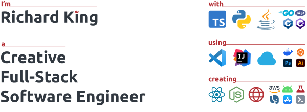

## 🖐️ Hello!

I'm Richard King, a **Full-Stack Software Engineer** and a ***UI/UX/Web Design enthusiast*** with **15 years in the industry**.

<!--  

    
  <picture>
    <source srcset="header_600.svg" media="(min-width: 950px)" />
    <source srcset="header_460.svg" media="(min-width: 525px)" />
    <source srcset="header_300.svg" media="(min-width: 200px)" />    
      
  </picture>

-->

## 🚀 Projects

<!-- @intradoc Projects -->
<ul>
  <!---------- Pressfield ---------->
  <li>
    <a href="https://github.com/pressfield" title="Pressfield"></a>
    <b>&nbsp;Pressfield</b>
    <i>(<a href="https://github.com/pressfield">github.com/pressfield</a>)</i>
    

      Smart, automated, AI-driven software release updates and changelog publishing.
    

    

      <i title="Pressfield-related keywords">- Keywords:</i> <b><i title="Artificial Intelligence">AI</i>, <i title="Machine Learning">ML</i></b>
       
      <i title="Pressfield-related tech stack">- Tech Stack:</i> <a href="https://github.com/pressfield" title="JavaScript"></a> <a href="https://github.com/pressfield" title="TypeScript"></a>
      

    

  </li>
</ul>

<!-- @intradoc Projects -->

## 🤝 Connect

Feel free to connect with me through these links, though please keep in mind ***I may not be able to respond promptly due to my busy schedule*** and workload. **Thank you for your understanding in advance! 😊**

 

<!-- 1st row -->

  <!-- X (Twitter) -->
    
  <!-- Instagram -->
  
  <!-- Stack Overflow -->
    

<!-- 2nd row -->

  <!-- Blog -->
  
  <!-- LinkedIn -->
  
  <!-- Email -->
  

<!-- 3rd row -->

  <!-- Website -->
  

