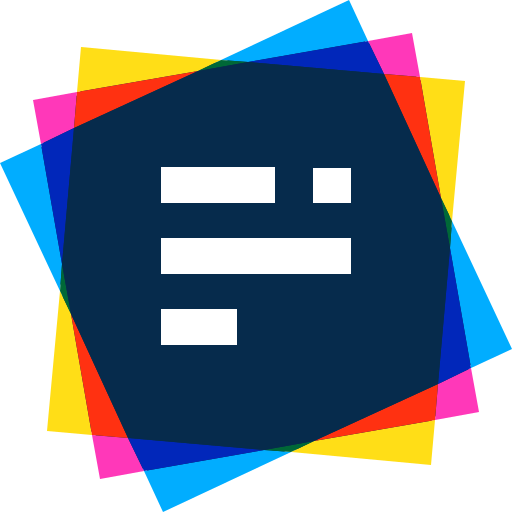
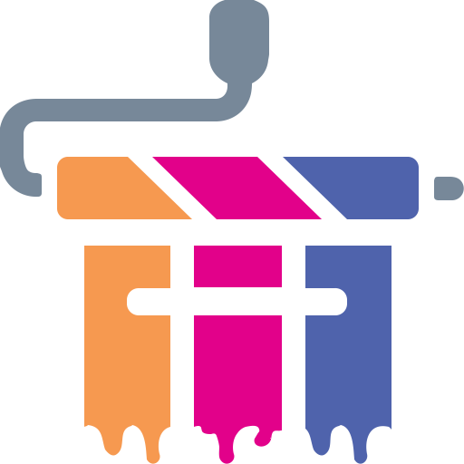

## 🖐️ Hello!

I'm Richard King, a **Full-Stack Software Engineer** and a ***UI/UX/Web Design enthusiast*** with **15 years in the industry**.

<!--  

    
  <picture>
    <source srcset="header_600.svg" media="(min-width: 950px)" />
    <source srcset="header_460.svg" media="(min-width: 525px)" />
    <source srcset="header_300.svg" media="(min-width: 200px)" />    
      
  </picture>

-->

## 🚀 Projects

<!-- @intradoc Projects -->
<ul>
  <!-- Pressfield -->
  <li>
    <h3><a href="https://github.com/pressfield" title="Pressfield logo"></a>&nbsp; Pressfield <i>(<a href="https://github.com/pressfield">github.com/pressfield</a>)</i></h3><h4>Smart, automated, AI-driven software release updates and changelog publishing.</h4>
    

      <i title="Pressfield-related keywords">- Keywords:</i> <b><i title="Artificial Intelligence">AI</i>, <i title="Machine Learning">ML</i>, <i title="Software Development & IT Operations">DevOps</i>, <i title="Continuous Integration & Continuous Delivery">CI/CD</i>, <i title="Online Social Media">Social Media</i></b>
       
      <i title="Pressfield-related tech stack">- Tech Stack:</i> <a href="https://github.com/pressfield" title="JavaScript"></a> <a href="https://github.com/pressfield" title="TypeScript"></a> <a href="https://github.com/pressfield" title="Python"></a>
      
    

  </li>
  <!-- Data Sources -->
  <li>
    <h3><a href="https://github.com/data-sources" title="Data Sources logo"></a>&nbsp; Data Sources <i>(<a href="https://github.com/data-sources">github.com/data-sources</a>)</i></h3><h4>A collection of various open source data sets packaged and prepared.</h4>
    

      <i title="Data Sources-related keywords">- Keywords:</i> <b><i title="Data Science">Data Science</i>, <i title="Statistics">Statistics</i>, <i title="Analytics">Analytics</i></b>
       
      <i title="Data Sources-related tech stack">- Tech Stack:</i> <a href="https://github.com/data-sources" title="JavaScript"></a> <a href="https://github.com/data-sources" title="Python"></a> <a href="https://github.com/data-sources" title="Java"></a>
      
    

  </li>
  <!-- Grandom -->
  <li>
    <h3><a href="https://github.com/grandom" title="Grandom logo"></a>&nbsp; Grandom <i>(<a href="https://github.com/grandom">github.com/grandom</a>)</i></h3><h4>A configurable, flexible, and versatile random number and data generator library.</h4>
    

      <i title="Grandom-related keywords">- Keywords:</i> <b><i title="Random">Random</i>, <i title="Data">Data</i>, <i title="Testing">Testing</i>, <i title="Utilities">Utilities</i></b>
       
      <i title="Grandom-related tech stack">- Tech Stack:</i> <a href="https://github.com/grandom" title="JavaScript"></a> <a href="https://github.com/grandom" title="Python"></a> <a href="https://github.com/grandom" title="Java"></a>
      
    

  </li>
  <!-- Extended -->
  <li>
    <h3><a href="https://github.com/extended-library" title="Extended logo"></a>&nbsp; Extended <i>(<a href="https://github.com/extended-library">github.com/extended-library</a>)</i></h3><h4>Various useful JavaScript helpers, tools, and utilities.</h4>
    

      <i title="Extended-related keywords">- Keywords:</i> <b><i title="Utilities">Utilities</i>, <i title="Tools">Tools</i>, <i title="Helpers">Helpers</i></b>
       
      <i title="Extended-related tech stack">- Tech Stack:</i> <a href="https://github.com/extended-library" title="JavaScript"></a> <a href="https://github.com/extended-library" title="TypeScript"></a>
      
    

  </li>
  <!-- Reactory -->
  <li>
    <h3><a href="https://github.com/reactory" title="Reactory logo"></a>&nbsp; Reactory <i>(<a href="https://github.com/reactory">github.com/reactory</a>)</i></h3><h4>Common React tools, helpers, and utilities</h4>
    

      <i title="Reactory-related keywords">- Keywords:</i> <b><i title="React">React</i>, <i title="React Native">React Native</i>, <i title="Utilities">Utilities</i></b>
       
      <i title="Reactory-related tech stack">- Tech Stack:</i> <a href="https://github.com/reactory" title="JavaScript"></a> <a href="https://github.com/reactory" title="TypeScript"></a>
      
    

  </li>
  <!-- Stylebox -->
  <li>
    <h3><a href="https://github.com/stylebox-library" title="Stylebox logo"></a>&nbsp; Stylebox <i>(<a href="https://github.com/stylebox-library">github.com/stylebox-library</a>)</i></h3><h4>Compact styling toolbox. A modular, flexible CSS styling library.</h4>
    

      <i title="Stylebox-related keywords">- Keywords:</i> <b><i title="Cascading Style Sheets">CSS</i>, <i title="Styling">Styling</i>, <i title="React">React</i>, <i title="React Native">React Native</i></b>
       
      <i title="Stylebox-related tech stack">- Tech Stack:</i> <a href="https://github.com/stylebox-library" title="JavaScript"></a> <a href="https://github.com/stylebox-library" title="TypeScript"></a>
      
    

  </li>
</ul>

<!-- @intradoc Projects -->

## 🤝 Connect

Feel free to connect with me through these links, though please keep in mind ***I may not be able to respond promptly due to my busy schedule*** and workload. **Thank you for your understanding in advance! 😊**

 

<!-- 1st row -->

  <!-- X (Twitter) -->
    
  <!-- Instagram -->
  
  <!-- Stack Overflow -->
    

<!-- 2nd row -->

  <!-- Blog -->
  
  <!-- LinkedIn -->
  
  <!-- Email -->
  

<!-- 3rd row -->

  <!-- Website -->
  

