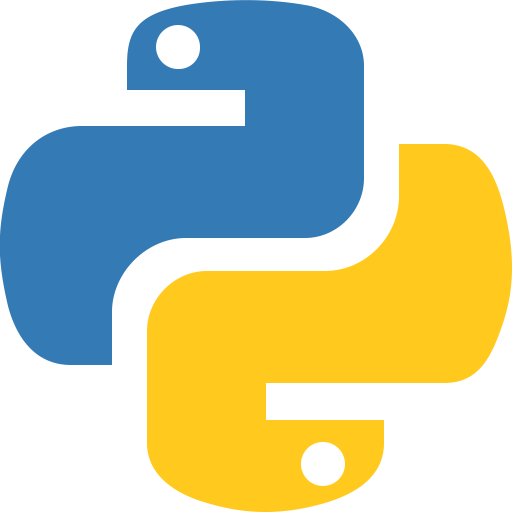

## 🖐️ Hello!

<!-- @intradoc Intro -->
I'm Richard King, a **Full-Stack Software Engineer**
and a ***UI/UX/Web Design enthusiast*** with **15+ years of experience**,
an *eager polyglot*:

- **proficient** in:&nbsp; <a href="github.com/richrdkng" title="JavaScript"></a> **JavaScript**,&nbsp; <a href="github.com/richrdkng" title="TypeScript"></a> **TypeScript**,&nbsp; <a href="github.com/richrdkng" title="Python"></a> **Python**,&nbsp; <a href="github.com/richrdkng" title="Java"></a> **Java**

- ***competent*** in:&nbsp; <a href="github.com/richrdkng" title="PHP"></a> ***PHP***,&nbsp; <a href="github.com/richrdkng" title="Ruby"></a> ***Ruby***,&nbsp; <a href="github.com/richrdkng" title="C"></a> ***C***,&nbsp; <a href="github.com/richrdkng" title="C++"></a> ***C++***

- ***learning***:&nbsp; <a href="github.com/richrdkng" title="Rust"></a> ***Rust***,&nbsp; <a href="github.com/richrdkng" title="Go"></a> ***Go***

crafting **open source** ***tools, utilities, and libraries***,
creating enterprise solutions using
<a href="github.com/richrdkng" title="React"></a> **React**
***(inc.*** <a href="github.com/richrdkng" title="React Native"></a> ***React Native)***,
<a href="github.com/richrdkng" title="Django"></a> **Django**, and
<a href="github.com/richrdkng" title="Spring Boot"></a> **Spring Boot**,
writing about software-related topics,
and advising on various IT projects.
<!-- @intradoc Intro -->

## 🚀 Projects

<!-- TODO: 1-2 main sentence -->

<!-- @intradoc Projects -->
<ul>
  <!-- Pressfield -->
  <li>
    <h3><a href="https://github.com/pressfield" title="Pressfield logo"></a>&nbsp; Pressfield <i>(<a href="https://github.com/pressfield">github.com/pressfield</a>)</i></h3><h4>Smart, automated, AI-driven software release updates and changelog publishing.</h4>
    

      <i title="Pressfield-related keywords">- Keywords:</i> <b><i title="Artificial Intelligence">AI</i>, <i title="Machine Learning">ML</i>, <i title="Software Development & IT Operations">DevOps</i>, <i title="Continuous Integration & Continuous Delivery">CI/CD</i>, <i title="Online Social Media">Social Media</i></b>
       
      <i title="Pressfield-related tech stack">- Tech Stack:</i> <a href="https://github.com/pressfield" title="JavaScript"></a> <a href="https://github.com/pressfield" title="TypeScript"></a> <a href="https://github.com/pressfield" title="Python"></a>
      
    

  </li>
  <!-- Data Sources -->
  <li>
    <h3><a href="https://github.com/data-sources" title="Data Sources logo"></a>&nbsp; Data Sources <i>(<a href="https://github.com/data-sources">github.com/data-sources</a>)</i></h3><h4>A collection of various open source data sets packaged and prepared.</h4>
    

      <i title="Data Sources-related keywords">- Keywords:</i> <b><i title="Data Science">Data Science</i>, <i title="Statistics">Statistics</i>, <i title="Analytics">Analytics</i></b>
       
      <i title="Data Sources-related tech stack">- Tech Stack:</i> <a href="https://github.com/data-sources" title="JavaScript"></a> <a href="https://github.com/data-sources" title="Python"></a> <a href="https://github.com/data-sources" title="Java"></a>
      
    

  </li>
  <!-- Grandom -->
  <li>
    <h3><a href="https://github.com/grandom" title="Grandom logo"></a>&nbsp; Grandom <i>(<a href="https://github.com/grandom">github.com/grandom</a>)</i></h3><h4>A configurable, flexible, and versatile random number and data generator library.</h4>
    

      <i title="Grandom-related keywords">- Keywords:</i> <b><i title="Random">Random</i>, <i title="Data">Data</i>, <i title="Testing">Testing</i>, <i title="Utilities">Utilities</i></b>
       
      <i title="Grandom-related tech stack">- Tech Stack:</i> <a href="https://github.com/grandom" title="JavaScript"></a> <a href="https://github.com/grandom" title="Python"></a> <a href="https://github.com/grandom" title="Java"></a>
      
    

  </li>
  <!-- Extended -->
  <li>
    <h3><a href="https://github.com/extended-library" title="Extended logo"></a>&nbsp; Extended <i>(<a href="https://github.com/extended-library">github.com/extended-library</a>)</i></h3><h4>Various useful JavaScript helpers, tools, and utilities.</h4>
    

      <i title="Extended-related keywords">- Keywords:</i> <b><i title="Utilities">Utilities</i>, <i title="Tools">Tools</i>, <i title="Helpers">Helpers</i></b>
       
      <i title="Extended-related tech stack">- Tech Stack:</i> <a href="https://github.com/extended-library" title="JavaScript"></a> <a href="https://github.com/extended-library" title="TypeScript"></a>
      
    

  </li>
  <!-- Reactory -->
  <li>
    <h3><a href="https://github.com/reactory" title="Reactory logo"></a>&nbsp; Reactory <i>(<a href="https://github.com/reactory">github.com/reactory</a>)</i></h3><h4>Common React tools, helpers, and utilities</h4>
    

      <i title="Reactory-related keywords">- Keywords:</i> <b><i title="React">React</i>, <i title="React Native">React Native</i>, <i title="Utilities">Utilities</i></b>
       
      <i title="Reactory-related tech stack">- Tech Stack:</i> <a href="https://github.com/reactory" title="JavaScript"></a> <a href="https://github.com/reactory" title="TypeScript"></a>
      
    

  </li>
  <!-- Stylebox -->
  <li>
    <h3><a href="https://github.com/stylebox-library" title="Stylebox logo"></a>&nbsp; Stylebox <i>(<a href="https://github.com/stylebox-library">github.com/stylebox-library</a>)</i></h3><h4>Compact styling toolbox. A modular, flexible CSS styling library.</h4>
    

      <i title="Stylebox-related keywords">- Keywords:</i> <b><i title="Cascading Style Sheets">CSS</i>, <i title="Styling">Styling</i>, <i title="React">React</i>, <i title="React Native">React Native</i></b>
       
      <i title="Stylebox-related tech stack">- Tech Stack:</i> <a href="https://github.com/stylebox-library" title="JavaScript"></a> <a href="https://github.com/stylebox-library" title="TypeScript"></a>
      
    

  </li>
</ul>

<!-- @intradoc Projects -->

## 🤝 Connect

Feel free to connect with me through these links, though please keep in mind ***I may not be able to respond promptly due to my busy schedule*** and workload. **Thank you for your understanding in advance! 😊**

 

<!-- @intradoc Connect -->
<!-- 1st row -->

  <!-- Twitter -->
  
  <!-- Instagram -->
  
  <!-- Stack Overflow -->
  

<!-- 2nd row -->

  <!-- Blog -->
  
  <!-- LinkedIn -->
  
  <!-- Email -->
  

<!-- 3rd row -->

  <!-- Website -->
  

<!-- @intradoc Connect -->

## 🍻 Support

Maintaining open source projects ***takes time and effort***. If you find value in any of what I create, **please consider supporting my work** through one of the provided links. ***Your generosity fuels the open source community. Thank you!*** ❤️

<!-- TODO: cashapp tag, donably, gh sponsors, liberapay, boosty.to, donorbox.org, crypto and more (https://github.com/Ileriayo/markdown-badges#-funding) -->

 

<!-- @intradoc Support -->
<!-- 1st row -->

  <!-- PayPal -->
  
  <!-- Patreon -->
  
  <!-- SubscribeStar -->
  

<!-- 2nd row -->

  <!-- Ko-fi -->
  
  <!-- Buy me a coffee -->
  

<!-- @intradoc Support -->

 
