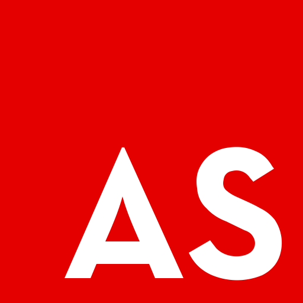
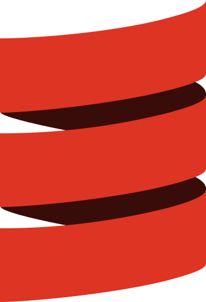
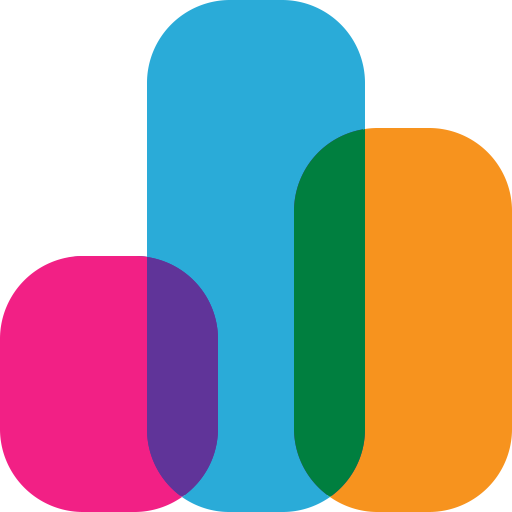

## 🖐️ Hey!

I'm Richard King, a **Full-Stack Software Engineer** and a ***UI/UX/Web Design enthusiast*** 
with **15+ years of experience**, an *eager polyglot*:

---

<!-- @intradoc IntroTop -->
- **proficient in**:&nbsp;&nbsp; <a href="github.com/richrdkng" title="JavaScript"></a> **JavaScript**,&nbsp;&nbsp; <a href="github.com/richrdkng" title="TypeScript"></a> **TypeScript**,&nbsp;&nbsp; <a href="github.com/richrdkng" title="Python"></a> **Python**,&nbsp;&nbsp; <a href="github.com/richrdkng" title="Java"></a> **Java**

- ***competent in***:&nbsp;&nbsp; <a href="github.com/richrdkng" title="PHP"></a> ***PHP***,&nbsp;&nbsp; <a href="github.com/richrdkng" title="Ruby"></a> ***Ruby***,&nbsp;&nbsp; <a href="github.com/richrdkng" title="C"></a> ***C***,&nbsp;&nbsp; <a href="github.com/richrdkng" title="C++"></a> ***C++***

- ***learning***:&nbsp;&nbsp; <a href="github.com/richrdkng" title="Rust"></a> **Rust**,&nbsp;&nbsp; <a href="github.com/richrdkng" title="Go"></a> **Go**

---

- *used a while ago*:&nbsp; <a href="github.com/richrdkng" title="Kotlin"></a> *Kotlin*,&nbsp; <a href="github.com/richrdkng" title="Lua"></a> *Lua*,&nbsp; <a href="github.com/richrdkng" title="R"></a> *R*,&nbsp; <a href="github.com/richrdkng" title="ActionScript"></a> *ActionScript*

- *rarely used / tried out*:&nbsp; <a href="github.com/richrdkng" title="C#"></a> *C#*,&nbsp; <a href="github.com/richrdkng" title="Scala"></a> *Scala*,&nbsp; <a href="github.com/richrdkng" title="Swift"></a> *Swift*,&nbsp; <a href="github.com/richrdkng" title="Dart"></a> *Dart*,&nbsp; <a href="github.com/richrdkng" title="Perl"></a> *Perl*
<!-- @intradoc IntroTop -->
  

I use my own [**custom, 3-monitor workstation setup**](github.com) with
a *MacBook Pro next to it to*:

---

<!-- @intradoc IntroBottom -->
- craft **open source** ***tools, utilities, and libraries***.

- create enterprise solutions using
<a href="github.com/richrdkng" title="React"></a> **React**
***(inc.*** <a href="github.com/richrdkng" title="React Native"></a> ***React Native)***,
<a href="github.com/richrdkng" title="Django"></a> **Django**, and
<a href="github.com/richrdkng" title="Spring Boot"></a> **Spring Boot**,

- writing about software-related topics on my blog

- advise on various IT projects.

Work Environment:
Development Environment:

I use a dual-boot Windows/Linux
I use a 3 monitor workstation with Windows/Linux dualboot.

And a MacBook Pro for iOS/MacOS-related projects
I use Windows (WSL)
I design, create Adobe Photoshop, and Adobe Illustrator
<!-- @intradoc IntroBottom -->
 

## 🚀 Projects

Throughout my **15+-year career in software development**, several key software solutions have arisen from the simplest sets of ***helper functions***, through more expansive ***tools***, ***utils***, and ***libraries***, to the extent of ***full-fledged software solution suites*** based on requirements of various levels and scopes ranging *from simpler personal experiments to large-scale enterprises*.

 
<!-- @intradoc Projects -->

<!-- Pressfield -->
- <a href="https://github.com/pressfield" title="Pressfield"></a>&nbsp; **Pressfield** <i>(<a href="https://github.com/pressfield" title="GitHub repository of Pressfield">github.com/pressfield</a>)</i> &nbsp;――&nbsp; <a href="https://github.com/pressfield" title="JavaScript"></a> <a href="https://github.com/pressfield" title="TypeScript"></a> <a href="https://github.com/pressfield" title="Python"></a> &nbsp;――&nbsp; <b title="Artificial Intelligence"><i>AI</i></b>, <b title="Machine Learning"><i>ML</i></b>, <b title="Software Development & IT Operations"><i>DevOps</i></b>, <b title="Continuous Integration & Continuous Delivery"><i>CI/CD</i></b>, <b title="Online Social Media"><i>Social Media</i></b>

  

    
&nbsp;&nbsp;&nbsp;&nbsp; Smart, automated, AI-driven software release updates and changelog publishing.

     
    Peek a boo!
    Smart, automated, AI-driven software release updates and changelog publishing.
      
  

<!-- Data Sources -->
- <a href="https://github.com/data-sources" title="Data Sources"></a>&nbsp; **Data Sources** <i>(<a href="https://github.com/data-sources" title="GitHub repository of Data Sources">github.com/data-sources</a>)</i> &nbsp;――&nbsp; <a href="https://github.com/data-sources" title="JavaScript"></a> <a href="https://github.com/data-sources" title="Python"></a> <a href="https://github.com/data-sources" title="Java"></a> &nbsp;――&nbsp; <b title="Data Science"><i>Data Science</i></b>, <b title="Statistics"><i>Statistics</i></b>, <b title="Analytics"><i>Analytics</i></b>

  

    
&nbsp;&nbsp;&nbsp;&nbsp; A collection of various open source data sets packaged and prepared.

     
    Peek a boo!
    A collection of various open source data sets packaged and prepared.
      
  

<!-- Grandom -->
- <a href="https://github.com/grandom" title="Grandom"></a>&nbsp; **Grandom** <i>(<a href="https://github.com/grandom" title="GitHub repository of Grandom">github.com/grandom</a>)</i> &nbsp;――&nbsp; <a href="https://github.com/grandom" title="JavaScript"></a> <a href="https://github.com/grandom" title="Python"></a> <a href="https://github.com/grandom" title="Java"></a> &nbsp;――&nbsp; <b title="Random"><i>Random</i></b>, <b title="Data"><i>Data</i></b>, <b title="Testing"><i>Testing</i></b>, <b title="Utilities"><i>Utilities</i></b>

  

    
&nbsp;&nbsp;&nbsp;&nbsp; A configurable, flexible, and versatile random number and data generator library.

     
    Peek a boo!
    A configurable, flexible, and versatile random number and data generator library.
      
  

<!-- Extended -->
- <a href="https://github.com/extended-library" title="Extended"></a>&nbsp; **Extended** <i>(<a href="https://github.com/extended-library" title="GitHub repository of Extended">github.com/extended-library</a>)</i> &nbsp;――&nbsp; <a href="https://github.com/extended-library" title="JavaScript"></a> <a href="https://github.com/extended-library" title="TypeScript"></a> &nbsp;――&nbsp; <b title="Utilities"><i>Utilities</i></b>, <b title="Tools"><i>Tools</i></b>, <b title="Helpers"><i>Helpers</i></b>

  

    
&nbsp;&nbsp;&nbsp;&nbsp; Various useful JavaScript helpers, tools, and utilities.

     
    Peek a boo!
    Various useful JavaScript helpers, tools, and utilities.
      
  

<!-- Reactory -->
- <a href="https://github.com/reactory" title="Reactory"></a>&nbsp; **Reactory** <i>(<a href="https://github.com/reactory" title="GitHub repository of Reactory">github.com/reactory</a>)</i> &nbsp;――&nbsp; <a href="https://github.com/reactory" title="JavaScript"></a> <a href="https://github.com/reactory" title="TypeScript"></a> &nbsp;――&nbsp; <b title="React"><i>React</i></b>, <b title="React Native"><i>React Native</i></b>, <b title="Utilities"><i>Utilities</i></b>

  

    
&nbsp;&nbsp;&nbsp;&nbsp; Common React tools, helpers, and utilities

     
    Peek a boo!
    Common React tools, helpers, and utilities
      
  

<!-- Stylebox -->
- <a href="https://github.com/stylebox-library" title="Stylebox"></a>&nbsp; **Stylebox** <i>(<a href="https://github.com/stylebox-library" title="GitHub repository of Stylebox">github.com/stylebox-library</a>)</i> &nbsp;――&nbsp; <a href="https://github.com/stylebox-library" title="JavaScript"></a> <a href="https://github.com/stylebox-library" title="TypeScript"></a> &nbsp;――&nbsp; <b title="Cascading Style Sheets"><i>CSS</i></b>, <b title="Styling"><i>Styling</i></b>, <b title="React"><i>React</i></b>, <b title="React Native"><i>React Native</i></b>

  

    
&nbsp;&nbsp;&nbsp;&nbsp; Compact styling toolbox. A modular, flexible CSS styling library.

     
    Peek a boo!
    Compact styling toolbox. A modular, flexible CSS styling library.
      
  

 
<!-- @intradoc Projects -->

## 🤝 Connect

Feel free to connect with me through these links, though please keep in mind ***I may not be able to respond promptly due to my busy schedule*** and workload. **Thank you for your understanding in advance! 😊**

 

<!-- @intradoc Connect -->
<!-- 1st row -->

  <!-- Twitter -->
  
  <!-- Instagram -->
  
  <!-- Stack Overflow -->
  

<!-- 2nd row -->

  <!-- Blog -->
  
  <!-- LinkedIn -->
  
  <!-- Email -->
  

<!-- 3rd row -->

  <!-- Website -->
  

<!-- @intradoc Connect -->

## 🍻 Support

Maintaining open source projects ***takes time and effort***. If you find value in any of what I create, **please consider supporting my work** through one of the provided links. ***Your generosity fuels the open source community. Thank you!*** ❤️

<!-- TODO: cashapp tag, donably, gh sponsors, liberapay, boosty.to, donorbox.org, crypto and more (https://github.com/Ileriayo/markdown-badges#-funding) -->

 

<!-- @intradoc Support -->
<!-- 1st row -->

  <!-- PayPal -->
  
  <!-- Patreon -->
  
  <!-- SubscribeStar -->
  

<!-- 2nd row -->

  <!-- Ko-fi -->
  
  <!-- Buy me a coffee -->
  

<!-- @intradoc Support -->

 
